<div align="center">

# 🎖️ TERRAIN SCOUT III — Multi-Operational Defence Rover

### *AI-Powered Autonomous Defence Platform for Surveillance, Mine Detection & Threat Neutralization*

<br>

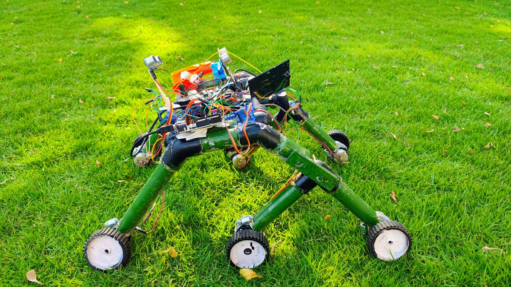

<br><br>

[](https://arduino.cc)
[](https://raspberrypi.org)
[](https://python.org)
[](https://opencv.org)
[](https://tensorflow.org)
[](LICENSE)
[](#-contributing)

<br>

**A multi-operational autonomous defence rover engineered with Raspberry Pi 4 and dual Arduino platforms. Featuring five integrated operational modes — AI-powered headshot tracking, 360° radar surveillance, capacitive mine detection, intelligent obstacle avoidance, and automated QuickFire defense — all powered by lithium-ion batteries with solar backup for extended field deployment.**

[🚀 Quick Start](#-quick-start) · [📖 How It Works](#-how-it-works) · [🏗️ Architecture](#%EF%B8%8F-system-architecture) · [🔧 Hardware](#-hardware-components) · [📸 Gallery](#-project-gallery) · [🗺️ Roadmap](#%EF%B8%8F-roadmap)

</div>

---

## 📌 Table of Contents

- [Highlights](#-highlights)
- [Why Terrain Scout III?](#-why-terrain-scout-iii)
- [Key Features](#-key-features)
- [Operational Modes](#-operational-modes)
- [Project Gallery](#-project-gallery)
- [Technical Poster](#-technical-poster)
- [System Architecture](#%EF%B8%8F-system-architecture)
- [How It Works](#-how-it-works)
- [Hardware Components](#-hardware-components)
- [Software Stack](#-software-stack)
- [Repository Structure](#-repository-structure)
- [Quick Start](#-quick-start)
- [Module Details](#-module-details)
- [Circuit & Wiring](#-circuit--wiring)
- [Demo Video](#-demo-video)
- [Roadmap](#%EF%B8%8F-roadmap)
- [Contributing](#-contributing)
- [License](#-license)

---

## ✨ Highlights

<table>
<tr>
<td width="50%">

🎯 **AI Face Tracking** — Real-time headshot detection with servo-based auto-targeting

📡 **360° Radar Sweep** — Continuous environment scanning with ultrasonic sensors

💣 **Mine Detection** — Capacitive metal detection for buried ordnance discovery

🛡️ **Obstacle Avoidance** — Autonomous navigation through complex terrain

⚡ **QuickFire Defense** — Automated threat engagement within detection zone

☀️ **Solar Backup** — Dual power system with Li-ion + solar emergency charging

</td>
<td width="50%">

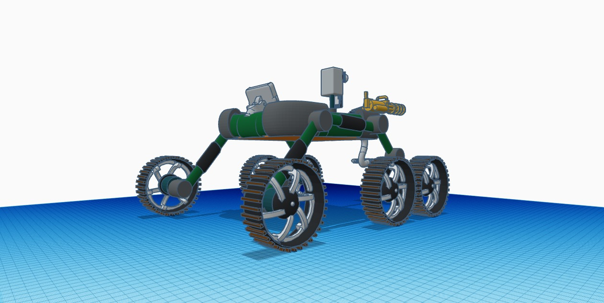

</td>
</tr>
</table>

---

## 💡 Why Terrain Scout III?

<div align="center">

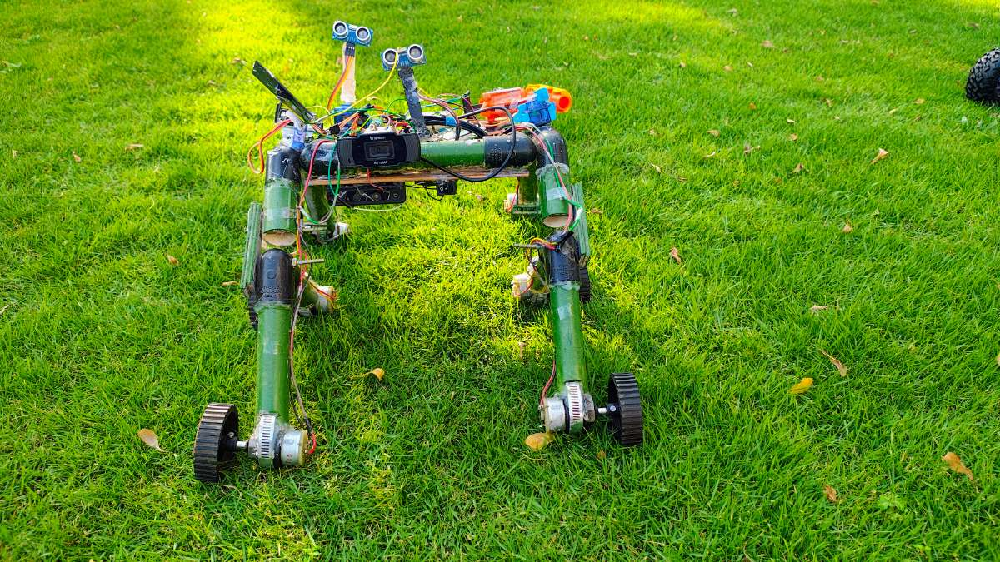

</div>

<br>

In modern defence and security operations, human personnel face life-threatening risks in mine-infested zones, hostile perimeters, and uncharted terrain. Manual surveillance and threat detection methods remain dangerously slow, error-prone, and resource-intensive:

| ❌ Current Problem | ✅ How Terrain Scout III Solves It |
|---|---|
| Manual mine detection puts soldiers at extreme risk | Autonomous capacitive mine detection from safe distance |
| Static surveillance cameras have blind spots and no response ability | 360° radar sweep with automated threat engagement |
| Human-operated weapons systems have delayed reaction times | AI-powered face tracking with sub-second target acquisition |
| Single-purpose robots can only perform one task at a time | Five integrated operational modes on a single platform |
| Fuel-dependent vehicles have limited field deployment time | Solar + Li-ion dual power for extended autonomous operation |
| Terrain navigation requires constant human oversight | Ultrasonic obstacle avoidance for autonomous pathfinding |

> **Terrain Scout III is not just a remote-controlled car — it's a fully autonomous, multi-modal defence platform that can scan, detect, track, and respond to threats without risking human lives.**

---

## 🚀 Key Features

<table>
<tr>
<td align="center" width="33%">
<h3>🎯 HeadShot Tracker</h3>
<p>Haar cascade face detection + servo-driven pan/tilt targeting with real-time HUD overlay</p>
</td>
<td align="center" width="33%">
<h3>📡 Radar System</h3>
<p>180° ultrasonic radar sweep with distance mapping and threat visualization via serial output</p>
</td>
<td align="center" width="33%">
<h3>💣 Mine Detector</h3>
<p>Capacitive sensing with electromagnetic field analysis — detects buried metallic objects</p>
</td>
</tr>
<tr>
<td align="center" width="33%">
<h3>🛡️ Obstacle Avoidance</h3>
<p>Dual HC-SR04 ultrasonic sensors for autonomous terrain navigation and collision prevention</p>
</td>
<td align="center" width="33%">
<h3>⚡ QuickFire</h3>
<p>Automated proximity-triggered defense mechanism with servo-actuated rapid-fire response</p>
</td>
<td align="center" width="33%">
<h3>☀️ Solar Power</h3>
<p>5V monocrystalline solar panel with Li-ion battery array for extended field deployment</p>
</td>
</tr>
</table>

---

## 🔫 Operational Modes

| # | Mode | Controller | Sensor | Response | Status |
|:---:|:---|:---|:---|:---|:---:|
| 1 | 🎯 **HeadShot Tracker** | Raspberry Pi 4 + Python | USB Webcam (1080p) | Servo pan/tilt targeting | ✅ Active |
| 2 | 📡 **Radar Surveillance** | Arduino UNO + L293D | HC-SR04 Ultrasonic | 180° sweep + distance mapping | ✅ Active |
| 3 | 💣 **Mine Detection** | Arduino Nano | Capacitive Coil Sensor | LED alert + flash frequency | ✅ Active |
| 4 | 🛡️ **Obstacle Avoidance** | Arduino UNO + L293D | 2× HC-SR04 Ultrasonic | Evasive maneuver servo | ✅ Active |
| 5 | ⚡ **QuickFire Defense** | Arduino UNO + L293D | HC-SR04 Ultrasonic | Auto-fire mechanism | ✅ Active |

---

## 📸 Project Gallery

<div align="center">

### 🤖 The Real Prototype (Physical Assembly)
*Actual hardware built for the project, featuring rocker-bogie chassis, sensors, and dual-axis camera turret.*

| | |
|:---:|:---:|
|  <br> **Fully Assembled Rover (Top-Down View)** | 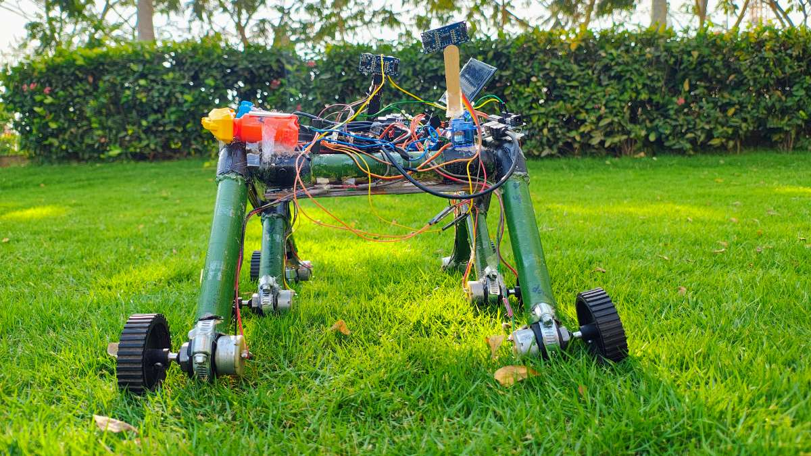 <br> **Front Chassis & Radar Sweep Servo** |
|  <br> **Ground Evasion Efficacy Test** | 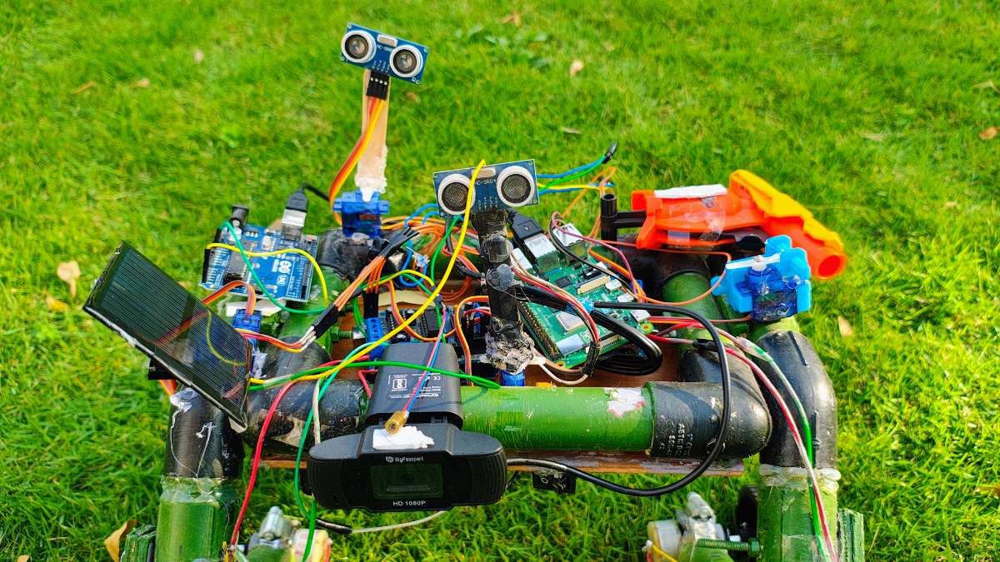 <br> **Rocker-Bogie 6-Motor Drive Train** |
| 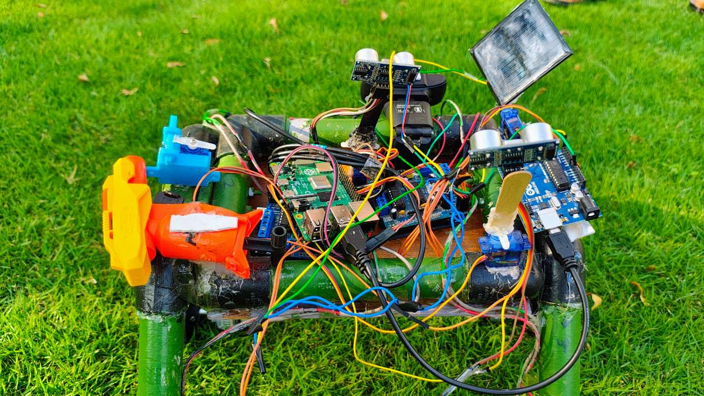 <br> **Laser Turret & Firing Mechanism Assembly** | 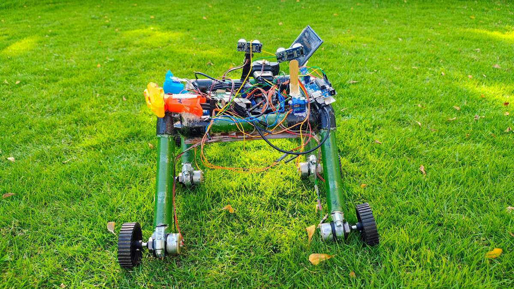 <br> **Power Distribution & Solar Panel Mount** |

<br>

### 📐 Computer-Aided Design (CAD) Models
*Precise 3D CAD modeling developed during the design and simulation phase.*

| | |
|:---:|:---:|
|  <br> **Isometric View of CAD Model** | 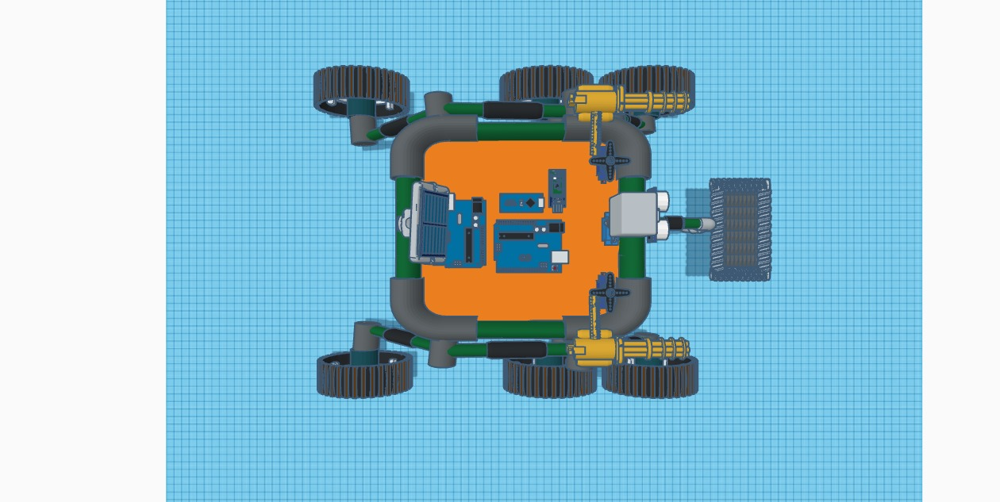 <br> **Front Elevation of Chassis** |
| 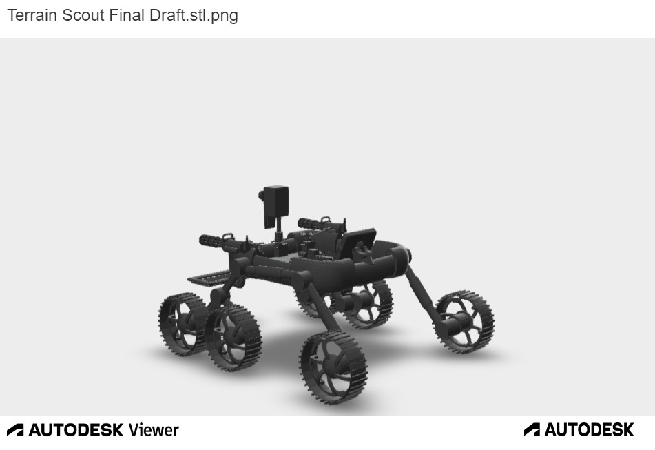 <br> **Top-Down Chassis Geometry** | 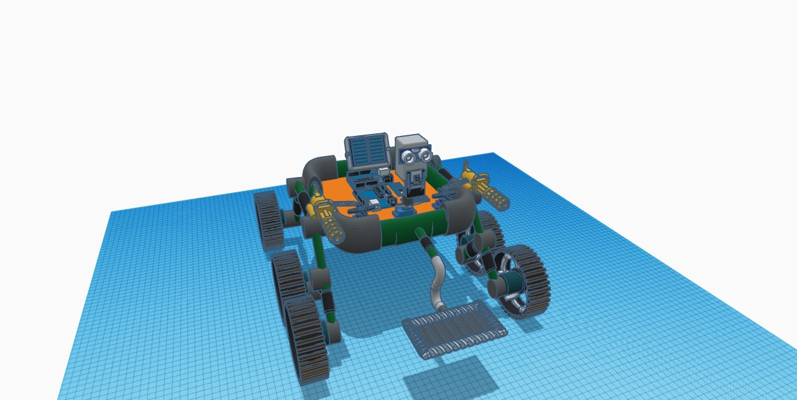 <br> **Rocker-Bogie Suspension CAD Detail** |

<br>

### ⚙️ Technical Diagrams & Flowcharts
*Block diagrams and process flowcharts extracted from technical documentation.*

| | |
|:---:|:---:|
| 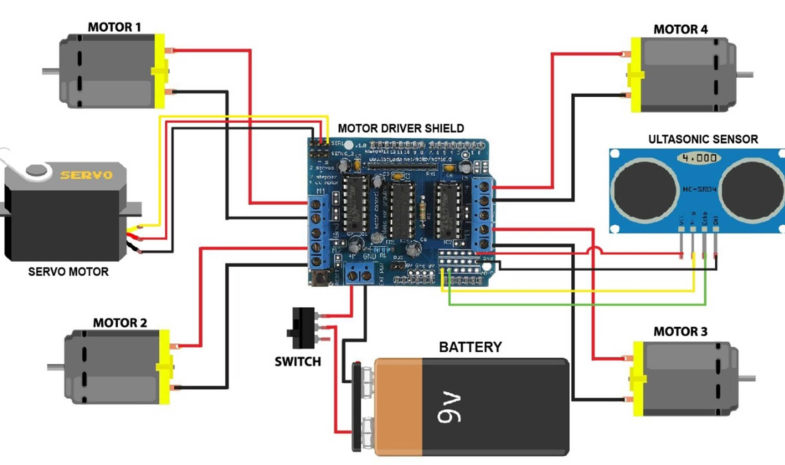 <br> **Locomotion & Obstacle Avoidance Block Diagram** | 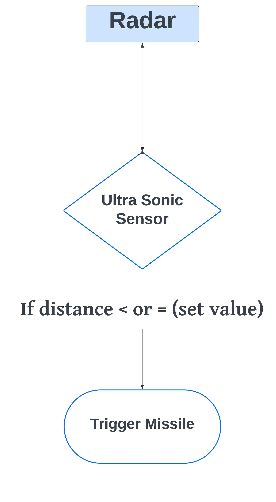 <br> **QuickFire Action System Diagram** |
| 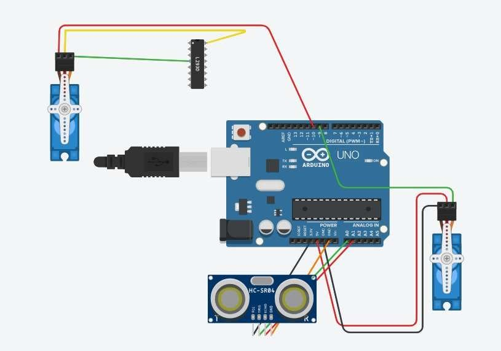 <br> **QuickFire Target Engagement Logic** | 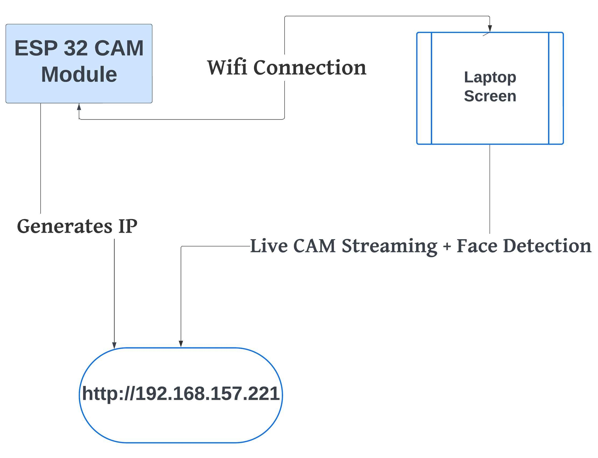 <br> **ESP32-CAM Object Recognition Logic** |

</div>

---

## 📋 Technical Poster

Here is the comprehensive project poster outlining the problem statement, objectives, key specifications, performance highlights, and system architecture for the Adaptive Modular System:

<div align="center">

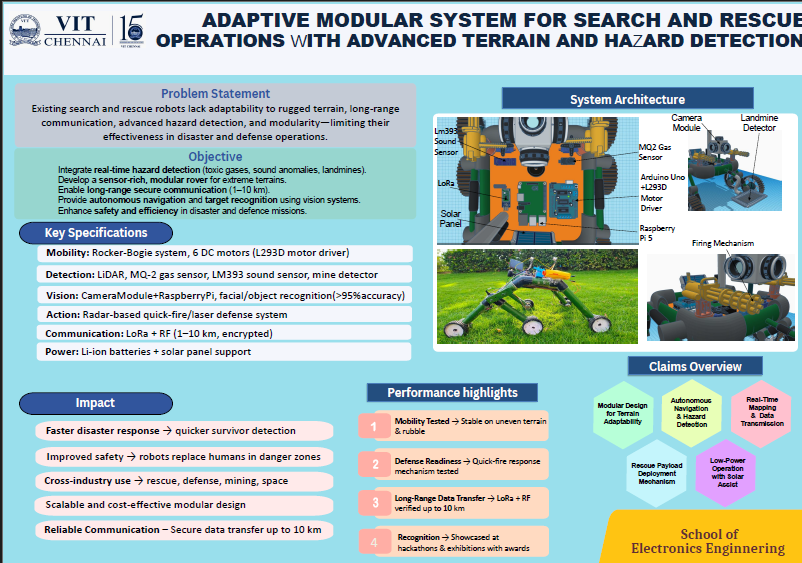

</div>

---

## 🏗️ System Architecture

<div align="center">

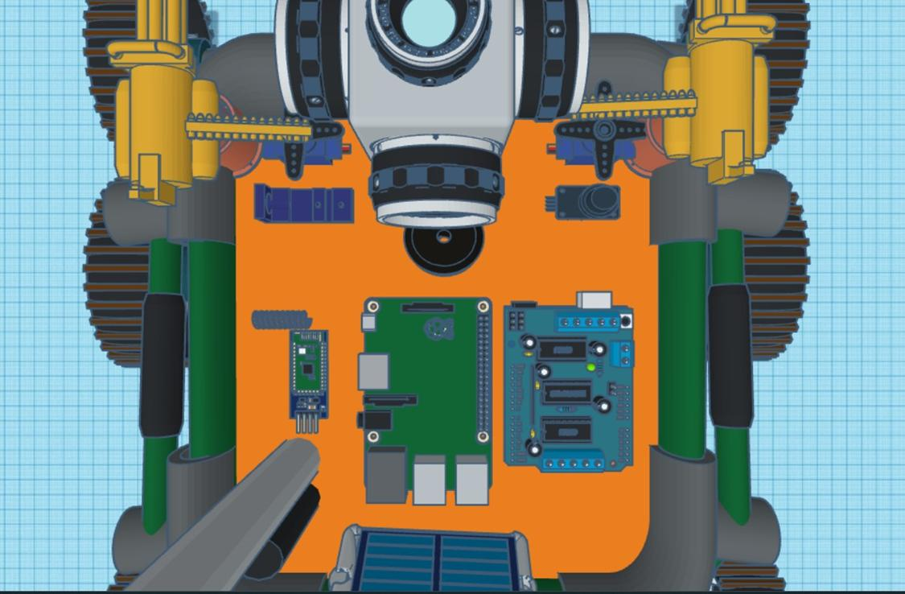

*Distributed computing block diagram showing components and hazard detection modules*

</div>

<br>

### 📐 Workflow Diagram of Operation

<div align="center">

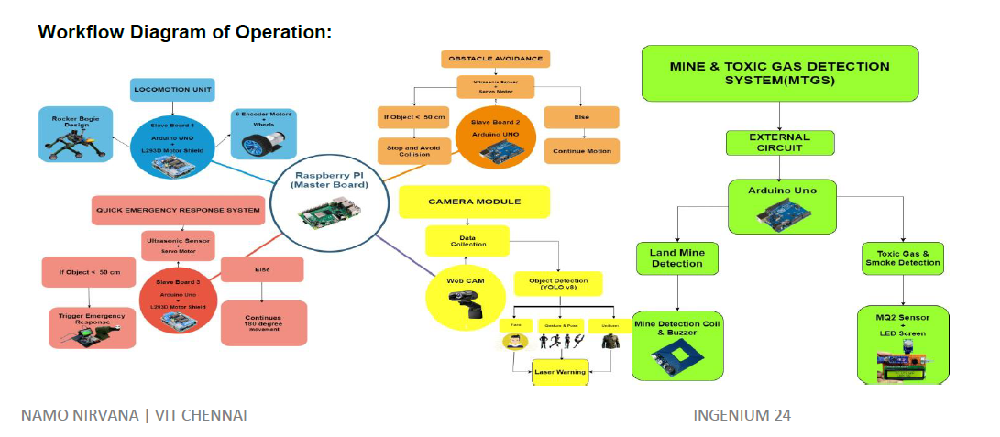

*Original workflow diagram showing the complete operational pipeline — from locomotion to threat detection*

</div>

<br>

The Terrain Scout III operates on a **distributed computing architecture** where the Raspberry Pi 4 handles AI/vision processing while Arduino boards manage real-time sensor control and actuation:

```
┌──────────────────────────────────────────────────────────────────────┐
│                     🧠 AI & VISION LAYER (Raspberry Pi 4)            │
│                                                                      │
│   ┌─────────────────┐    ┌─────────────────┐    ┌────────────────┐  │
│   │   📷 USB Webcam  │───▶│  🎯 Face Detect  │───▶│  🕹️ Servo Cmd  │  │
│   │   (1080p/24fps)  │    │ (Haar Cascade)   │    │  (Serial TX)   │  │
│   └─────────────────┘    └─────────────────┘    └───────┬────────┘  │
│                                                          │           │
│           Python 3.9  •  OpenCV  •  NumPy  •  TensorFlow │           │
└──────────────────────────────────────────┬───────────────┘           │
                                           │ USB Serial                │
                    ┌──────────────────────┼──────────────────────┐    │
                    │                      │                      │    │
                    ▼                      ▼                      ▼    │
┌─────────────────────────┐ ┌─────────────────────────┐ ┌─────────────────┐
│  🔴 ARDUINO UNO #1      │ │  🔵 ARDUINO UNO #2      │ │  🟢 ARDUINO NANO │
│  + L293D Motor Shield   │ │  + L293D Motor Shield   │ │                  │
│                         │ │                         │ │                  │
│  ┌───────────────────┐  │ │  ┌───────────────────┐  │ │  ┌────────────┐ │
│  │ 📡 Radar System    │  │ │  │ ⚡ QuickFire       │  │ │  │ 💣 Mine     │ │
│  │ • Servo sweep     │  │ │  │ • Threat scan     │  │ │  │  Detector  │ │
│  │ • HC-SR04 ranging │  │ │  │ • Auto-fire       │  │ │  │ • Cap sense│ │
│  │ • Serial output   │  │ │  │ • Servo trigger   │  │ │  │ • LED alert│ │
│  └───────────────────┘  │ │  └───────────────────┘  │ │  └────────────┘ │
│                         │ │                         │ │                  │
│  ┌───────────────────┐  │ │  ┌───────────────────┐  │ │  Pins:           │
│  │ 🛡️ Obstacle Avoid  │  │ │  │ 🕹️ Servo Control  │  │ │  A0 → Pulse Out │
│  │ • Dual ultrasonic │  │ │  │ • Pin 9 (scan)   │  │ │  A1 → Cap Read  │
│  │ • Evasion servo   │  │ │  │ • Pin 10 (fire)  │  │ │  D12 → LED      │
│  └───────────────────┘  │ │  └───────────────────┘  │ │                  │
└─────────────────────────┘ └─────────────────────────┘ └─────────────────┘
                    │                      │                      │
                    └──────────────────────┼──────────────────────┘
                                           │
                    ┌──────────────────────┴──────────────────────┐
                    │              ⚡ POWER SYSTEM                │
                    │                                             │
                    │   🔋 4× Li-ion 18650 (3.7V 2500mAh)       │
                    │   ☀️ Solar Panel 5V (Emergency Backup)      │
                    │   ⚙️ Motor Drivers (L293D × 2)             │
                    └─────────────────────────────────────────────┘
```

### Communication Flow

```
📷 Camera → 🧠 RPi4 (Face Detection) → 📡 Serial → 🕹️ Arduino (Servo Control)
                                                         │
                                    ┌────────────────────┼────────────────────┐
                                    ▼                    ▼                    ▼
                              📡 Radar Scan      ⚡ QuickFire          💣 Mine Detect
                              🛡️ Obstacle Avoid   🎯 Engagement         🔔 LED Alert
```

---

## ⚙️ How It Works

### HeadShot Tracker Pipeline

```
👤 Target Appears  →  📷 1080p Camera Captures  →  🖼️ Frame to Grayscale
                                                           │
                                                           ▼
                                               🧠 Haar Cascade Detection
                                                           │
                                                           ▼
                                               📐 Face → Servo Angle Map
                                                    (pixel → 0°–180°)
                                                           │
                                         ┌─────────────────┼──────────────────┐
                                         ▼                                    ▼
                                  🕹️ Pan Servo                        🕹️ Tilt Servo
                                  (Horizontal Track)                 (Vertical Track)
                                         │                                    │
                                         ▼                                    ▼
                                  🖥️ HUD Display: "TARGET LOCKED"
```

**Step-by-step:**

1. **Capture** — USB webcam streams 1080p frames at 24fps to the Raspberry Pi
2. **Detect** — Haar cascade classifier identifies frontal faces in each frame
3. **Map** — Face center coordinates are mapped to servo angles (0°–180°) using linear interpolation
4. **Track** — Pan/tilt servos physically orient the turret toward the detected target
5. **Display** — Military-style HUD overlay shows targeting reticle, servo telemetry, and lock status
6. **Engage** — (Optional) Trigger QuickFire mechanism upon sustained target lock

### Radar & Mine Detection Pipeline

```
📡 Servo Sweeps 0°→180°  →  🔊 Ultrasonic Ping  →  📏 Distance Measured
                                                           │
                                               ┌──────────┴──────────┐
                                               ▼                     ▼
                                        Distance > 30cm        Distance ≤ 30cm
                                        (Safe — Continue)      (THREAT DETECTED)
                                                                     │
                                                                     ▼
                                                              ⚡ Trigger Response
                                                              (Evasion / QuickFire)

💣 Coil Pulses Capacitor  →  📊 Analog Read  →  🧮 Moving Average Filter
                                                           │
                                               ┌──────────┴──────────┐
                                               ▼                     ▼
                                        No Deviation           Deviation Detected
                                        (Clear Terrain)        (METAL DETECTED!)
                                                                     │
                                                                     ▼
                                                              🔔 LED Flash Alert
                                                         (frequency ∝ signal strength)
```

---

## 🔧 Hardware Components

<div align="center">

| # | Component | Qty | Role |
|:---:|:---|:---:|:---|
| 1 | **Raspberry Pi 4 (4GB)** | 1 | Central AI/vision processing unit |
| 2 | **Arduino UNO** | 2 | Real-time sensor control & actuation |
| 3 | **Arduino Nano** | 1 | Dedicated mine detection controller |
| 4 | **L293D Motor Shield** | 2 | DC motor & servo driver interface |
| 5 | **USB Webcam (1080p)** | 1 | Vision input for face detection |
| 6 | **HC-SR04 Ultrasonic** | 2 | Distance sensing (radar + obstacle) |
| 7 | **Servo Motor MG995** | 4 | Pan/tilt turret + actuators |
| 8 | **Li-ion 18650 (3.7V 2500mAh)** | 4 | Primary power supply |
| 9 | **Solar Panel 5V** | 1 | Emergency power backup |
| 10 | **DC Motors** | 4 | Rover wheel drive |
| 11 | **Sensing Coil + Capacitor** | 1 | Capacitive metal detection antenna |
| 12 | **LED Indicator** | 1 | Mine detection alert |

</div>

<br>

> **Required:** Raspberry Pi 4 • 2× Arduino UNO • Arduino Nano • USB Webcam • 2× L293D Shields  
> **Sensors:** 2× HC-SR04 Ultrasonic • Capacitive Coil Sensor  
> **Actuators:** 4× MG995 Servos • 4× DC Motors  
> **Power:** 4× 18650 Li-ion Batteries • 5V Solar Panel  

---

## 💻 Software Stack

| Library / Tool | Role | Category |
|:---|:---|:---|
| `opencv-python` | Computer vision & face detection | 📷 Vision |
| `numpy` | Coordinate mapping & interpolation | 🧮 Math |
| `tensorflow` | Future DNN-based detection models | 🧠 ML |
| `pyserial` | RPi ↔ Arduino serial communication | 📡 Comm |
| `Arduino IDE` | Firmware development & flashing | 🔧 Dev |
| `Adafruit Motor Shield V2` | Motor & servo control library | ⚙️ Driver |
| `Processing` | Radar data visualization (optional) | 📊 Viz |

### Algorithms & Techniques

| Technique | Module | Description |
|:---|:---|:---|
| **Haar Cascade Classifier** | HeadShot Tracker | Pre-trained frontal face detection model |
| **Linear Interpolation** | HeadShot Tracker | Pixel-to-servo angle coordinate mapping |
| **Capacitive Sensing** | Mine Detector | Electromagnetic field change detection |
| **Exponential Moving Average** | Mine Detector | Signal filtering for noise reduction |
| **Ultrasonic ToF Ranging** | Radar / QuickFire | Time-of-flight distance measurement |
| **A* Pathfinding** | Obstacle Avoidance | (Planned) Optimal path computation |

---

## 📁 Repository Structure

```
Terrain-Scout-Multi-Operational-Rover/
│
├── 📄 README.md                              # This file
├── 📋 requirements.txt                       # Python dependencies
├── 📄 LICENSE                                # MIT License
├── 📄 CONTRIBUTING.md                        # Contribution guidelines
├── 📄 .gitignore                             # Git ignore rules
│
├── 🧠 src/                                   # Source code (all modules)
│   │
│   ├── 🎯 vision/                            # AI Vision Module
│   │   └── headshot_tracker.py               # Face detection + servo targeting
│   │
│   ├── 📡 radar/                             # Radar & Navigation Module
│   │   └── radar_obstacle_avoidance.ino      # 180° sweep + obstacle evasion
│   │
│   ├── 💣 mine_detector/                     # Mine Detection Module
│   │   └── mine_detector.ino                 # Capacitive metal sensing
│   │
│   └── ⚡ quickfire/                         # QuickFire Defense Module
│       └── quickfire_defense.ino             # Auto-engagement system
│
├── 🔧 hardware/                              # Hardware documentation
│   └── (schematics, wiring diagrams)
│
└── 📸 docs/                                  # Documentation assets
    └── images/                               # README images & diagrams
        ├── ts3_banner.png
        ├── system_architecture.png
        ├── operational_modes.png
        ├── why_this_matters.png
        └── concept_development.png
```

---

## 🚀 Quick Start

### Prerequisites

- **Python 3.9+** (for HeadShot Tracker)
- **Arduino IDE 2.0+** (for firmware flashing)
- **Raspberry Pi 4** (recommended) or any Linux/Windows machine
- USB Webcam, Servos, Ultrasonic sensors (see [Hardware Components](#-hardware-components))

### Installation

```bash
# 1. Clone the repository
git clone https://github.com/YOUR_USERNAME/Terrain-Scout-Multi-Operational-Rover.git
cd Terrain-Scout-Multi-Operational-Rover

# 2. Create a virtual environment (Python)
python -m venv venv
source venv/bin/activate        # Linux/macOS
# venv\Scripts\activate          # Windows

# 3. Install Python dependencies
pip install -r requirements.txt

# 4. Flash Arduino firmware
#    Open each .ino file in Arduino IDE and upload to the respective board:
#    - src/radar/radar_obstacle_avoidance.ino    → Arduino UNO #1
#    - src/quickfire/quickfire_defense.ino        → Arduino UNO #2
#    - src/mine_detector/mine_detector.ino        → Arduino Nano

# 5. Run the HeadShot Tracker
python src/vision/headshot_tracker.py
```

### Arduino Library Dependencies

Install these libraries via Arduino IDE Library Manager:

| Library | Version | Required By |
|:---|:---|:---|
| `Adafruit Motor Shield V2` | ≥1.0.0 | Radar, QuickFire |
| `Servo` | Built-in | All Arduino modules |
| `Wire` | Built-in | Motor Shield I2C |

---

## 🧠 Module Details

### 🎯 HeadShot Tracker

| Property | Details |
|:---|:---|
| **Platform** | Raspberry Pi 4 (Python 3.9) |
| **Detection** | Haar Cascade Classifier (`haarcascade_frontalface_default.xml`) |
| **Resolution** | 1920 × 1080 @ 24fps |
| **Servo Range** | 0°–180° (pan) × 0°–180° (tilt) |
| **Latency** | ~50ms per frame |
| **Output** | Serial command stream + visual HUD overlay |
| **Source** | [`src/vision/headshot_tracker.py`](src/vision/headshot_tracker.py) |

### 📡 Radar & Obstacle Avoidance

| Property | Details |
|:---|:---|
| **Platform** | Arduino UNO + L293D Shield |
| **Sensor** | HC-SR04 Ultrasonic (2cm–400cm range) |
| **Sweep** | 0°–180° continuous radar scan |
| **Threshold** | 30cm obstacle detection range |
| **Response** | Evasive servo maneuver + serial alert |
| **Source** | [`src/radar/radar_obstacle_avoidance.ino`](src/radar/radar_obstacle_avoidance.ino) |

### 💣 Mine Detector

| Property | Details |
|:---|:---|
| **Platform** | Arduino Nano |
| **Method** | Capacitive coil sensing (electromagnetic) |
| **Sampling** | 256 measurements per cycle |
| **Filter** | 64-sample exponential moving average |
| **Alert** | LED flash rate proportional to signal strength |
| **Source** | [`src/mine_detector/mine_detector.ino`](src/mine_detector/mine_detector.ino) |

### ⚡ QuickFire Defense

| Property | Details |
|:---|:---|
| **Platform** | Arduino UNO + L293D Shield |
| **Sensor** | HC-SR04 Ultrasonic |
| **Engagement Range** | ≤30cm from target |
| **Mechanism** | Servo-actuated rapid-fire launcher |
| **Cooldown** | 1000ms between engagements |
| **Source** | [`src/quickfire/quickfire_defense.ino`](src/quickfire/quickfire_defense.ino) |

---

## 🔌 Circuit & Wiring

### Pin Assignments

<table>
<tr>
<td>

**Arduino UNO #1 (Radar)**

| Pin | Connection |
|:---:|:---|
| 9 | Radar sweep servo (MG995) |
| 10 | Evasion response servo |
| A0 | HC-SR04 Trigger |
| A1 | HC-SR04 Echo |

</td>
<td>

**Arduino UNO #2 (QuickFire)**

| Pin | Connection |
|:---:|:---|
| 9 | Scan sweep servo (MG995) |
| 10 | Fire trigger servo |
| A0 | HC-SR04 Trigger |
| A1 | HC-SR04 Echo |

</td>
<td>

**Arduino Nano (Mine Detector)**

| Pin | Connection |
|:---:|:---|
| A0 | Pulse output (coil charge) |
| A1 | Capacitance measurement |
| D12 | Alert LED |

</td>
</tr>
</table>

### Power Distribution

```
    ┌─────────────────────────────────────────────────────┐
    │              ⚡ POWER DISTRIBUTION                   │
    │                                                      │
    │   🔋 4× 18650 Li-ion (3.7V 2500mAh each)           │
    │   ├── Series pair → 7.4V → Arduino VIN              │
    │   ├── Series pair → 7.4V → Motor drivers            │
    │   └── Buck converter → 5V → Raspberry Pi            │
    │                                                      │
    │   ☀️ Solar Panel (5V 1A)                             │
    │   └── Charging controller → Battery array            │
    │                                                      │
    │   Total Capacity: ~18.5Wh                            │
    │   Estimated Runtime: 2–4 hours (active operation)    │
    └─────────────────────────────────────────────────────┘
```

---

## 🔍 Troubleshooting

<details>
<summary><strong>📷 Camera not detected (HeadShot Tracker)</strong></summary>

- Check USB webcam connection and try an alternate USB port
- Verify camera index in `headshot_tracker.py` (default: `0`)
- Test with: `python -c "import cv2; cap = cv2.VideoCapture(0); print(cap.isOpened())"`
- On Raspberry Pi: `sudo usermod -a -G video $USER` then reboot
</details>

<details>
<summary><strong>🎯 Haar cascade file not found</strong></summary>

- Download `haarcascade_frontalface_default.xml` from [OpenCV GitHub](https://github.com/opencv/opencv/tree/master/data/haarcascades)
- Place it in `src/vision/` directory
- Update the `CASCADE_PATH` in `headshot_tracker.py`
</details>

<details>
<summary><strong>📡 Arduino not uploading firmware</strong></summary>

- Select correct board: Tools → Board → Arduino UNO / Arduino Nano
- Select correct COM port: Tools → Port
- For Nano: Try "ATmega328P (Old Bootloader)" processor option
- Install L293D Motor Shield library: Sketch → Include Library → Manage Libraries
</details>

<details>
<summary><strong>🔋 Servo jitter or brownout</strong></summary>

- Ensure adequate power supply — MG995 servos draw up to 1.2A each
- Use separate power rail for servos (not from Arduino 5V pin)
- Add 100µF capacitor across servo power lines
- Check battery charge level
</details>

<details>
<summary><strong>💣 Mine detector false positives</strong></summary>

- Allow 5–10 seconds warmup for baseline calibration
- Keep sensing coil away from large metal objects during startup
- Adjust `NUM_PULSES` (12) and `NUM_MEASURES` (256) for sensitivity tuning
- Shield wiring from motor interference
</details>

<details>
<summary><strong>📡 Ultrasonic sensor reading 0</strong></summary>

- Check Trig (A0) and Echo (A1) wiring
- Verify 5V power to HC-SR04 module
- Test with simple example: `pulseIn(echoPin, HIGH)` should return >0
- Maximum range is 400cm — ensure target is within range
</details>

---

## 🎬 Demo Video

Our complete system demonstration showcases all five operational modes working in real-time — from face tracking and radar scanning to mine detection and automated defense engagement.

<div align="center">

[](https://youtu.be/t6z_sI_cP-s)

*▶️ Click to watch the full system demonstration on YouTube*

</div>

---

## 🗺️ Roadmap

- [x] ✅ HeadShot Tracker (Face detection + servo targeting)
- [x] ✅ 360° Radar System (Ultrasonic sweep + serial output)
- [x] ✅ Capacitive Mine Detector (Metal detection + LED alert)
- [x] ✅ Obstacle Avoidance (Dual ultrasonic + evasion)
- [x] ✅ QuickFire Defense (Automated threat engagement)
- [x] ✅ Solar power backup integration
- [x] ✅ Multi-controller distributed architecture
- [ ] 🔄 DNN-based face detection (upgrade from Haar cascade)
- [ ] 🔄 YOLOv8 object classification
- [ ] 🔄 Serial communication bridge (RPi ↔ Arduino)
- [ ] 📋 SLAM-based autonomous navigation
- [ ] 📋 LoRa long-range remote control
- [ ] 📋 Web-based telemetry dashboard
- [ ] 📋 Thermal imaging integration
- [ ] 📋 GPS waypoint navigation
- [ ] 📋 Swarm coordination (multi-rover)

---

## 🤝 Contributing

Contributions are welcome! Here's how you can help:

1. **Fork** the repository
2. **Create** a feature branch: `git checkout -b feature/amazing-feature`
3. **Commit** your changes: `git commit -m 'Add amazing feature'`
4. **Push** to the branch: `git push origin feature/amazing-feature`
5. **Open** a Pull Request

### Areas for Contribution

- 🧠 Upgrading to DNN-based face/object detection
- 🗺️ Implementing SLAM navigation algorithms
- 📡 Adding LoRa/5G communication modules
- 📊 Building radar visualization tools
- 🔧 PCB design for integrated controller board
- 📖 Improving documentation & adding build tutorials
- 🐛 Bug fixes and performance optimization

See [CONTRIBUTING.md](CONTRIBUTING.md) for detailed guidelines.

---

## 👥 Authors & Team Credits

### 🛡️ The Development Team (VIT Chennai)
| 👨‍✈️ **Harsh Yadav** | 🛠️ **Avishkar Jaiswal** | ⚙️ **Thakur Akshaykumar Raj** | 📡 **Aqeeb Akeel** |
| :---: | :---: | :---: | :---: |
| **Team Lead** | Hardware & Firmware | System Design | Sensor Integration |
| [GitHub Profile](https://github.com/YOUR_USERNAME) | [Project Page](https://www.electronicwings.com/users/AvishkarJaiswal/projects/4540/multi-operational-defence-rover) | Engineering | Integration |


---

## 📄 License

This project is licensed under the [MIT License](LICENSE).

---

<div align="center">

*Built with 🎖️ for defence innovation and autonomous systems*

<br>


</div>
